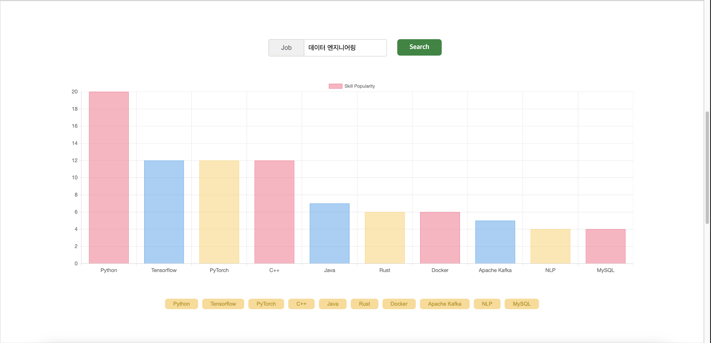
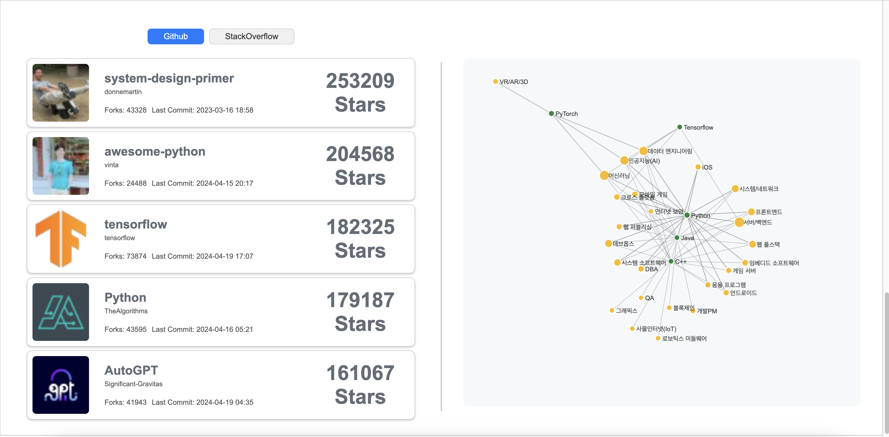
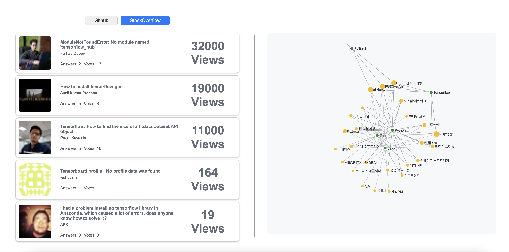
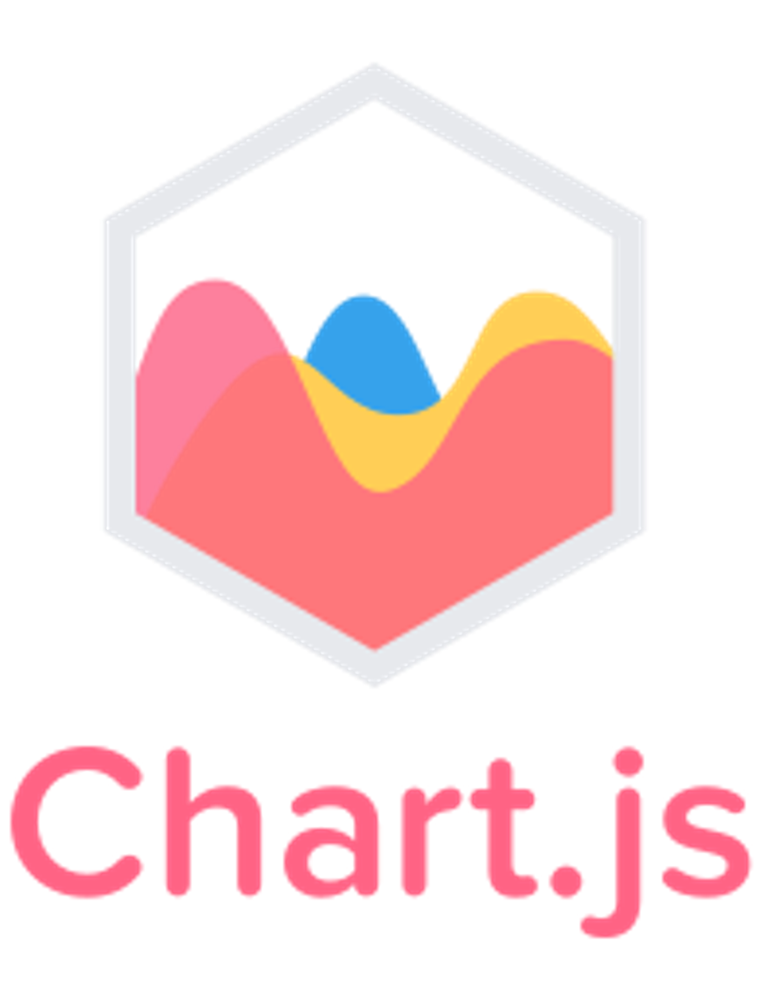

# StackHub

## 목차

- [프로젝트 주제](#프로젝트-주제)
- [프로젝트 소개](#프로젝트-소개)
- [기술 스택](#기술-스택)
- [협엽 명세](#협업-명세)
- [개발 인원](#개발-인원)
- [Easy-To-Use](#Easy-To-Use)

## 프로젝트 주제

프로그래머스 채용 공고 크롤링을 통한 기술스택과 기술스택의 레포지토리,질문 시각화

## 프로젝트 소개

기업에서 직무에 따라 원하는 기술스택이 다른데 우리가 하고자하는 직무의 기술스택이 어떤것이 있는지 알아보고 트렌드가 어떤지 확인하고 그 기술스택들이 github와 stackoverflow와 같은 개발자 커뮤니티에서는 우리와 같은 관심사를 가진 개발자들이 어떤 주제를 다루고 있고 또 어떤 문제들이 있는지 확인하며 한눈에 보기쉽게 그리고 이용하기 쉽게 하기 위해 선정하게 되었습니다. 
 

- [프로젝트 보고서](https://chivalrous-chili-f77.notion.site/3fe1616db3fa4cb08806753b37785a18)
- [결과물 소개 문서](https://www.canva.com/design/DAGC690HfWk/xYbHWDtp5okR22UI9sjZ_g/view?utm_content=DAGC690HfWk&utm_campaign=designshare&utm_medium=link&utm_source=editor)

 
1. **표지**
    
 

2. **시각화 페이지 직무별 스킬 인기도**

 

3. **시각화 페이지 스킬별 github repositroy**

 

4. **시각화 페이지 스킬별 stackoverflow question**

 

 

## 기술 스택

python --version = python 3.12

### 1. BackEnd

 

### 2. FrontEnd

 

### 3. Crawling

  

 

## 협업 명세

### 대시보드 디자인

### ERD

### API

   
### 개발 인원

|                                                                 FrontEnd                                                                 |                                                                 BackEnd                                                                  |                                                                 BackEnd                                                                  |                                                                 Crawling                                                                 |                                                                 Crawling                                                                 |
| :--------------------------------------------------------------------------------------------------------------------------------------: | :--------------------------------------------------------------------------------------------------------------------------------------: | :--------------------------------------------------------------------------------------------------------------------------------------: | :--------------------------------------------------------------------------------------------------------------------------------------: | :--------------------------------------------------------------------------------------------------------------------------------------: |
|                                                                  정승현                                                                  |                                                                  이승준                                                                  |                                                                  신용승                                                                  |                                                                  정기홍                                                                  |                                                                  이소윤                                                                  |
|  |  |  |  |  |

- 데이터 크롤링
  - 이소윤 : 데이터 크롤링 및 전처리(프로그래머스)
  - 정기홍 : 데이터 크롤링 및 전처리(github, stackoverflow)
- 백엔드
  - 신용승 : DB 관리 및 크롤링 데이터 DB 적재 모듈 개발 + 결과물 소개 문서 작성
  - 이승준 : DB 관리 및 API 개발
- 프론트엔드
  - 정승현 : 웹 페이지 템플릿 작성 및 데이터 시각화

 

## Easy-To-Use

1. git clone

2. cd GTProject

3. python -m venv venv (가상환경 생성)

4. python -m pip install -r requirements.txt (라이브러리 생성)

5. python manage.py makemigrations

6. python manage.py migrate

7. 크롤링 파일 실행 
   7-1. Programmers 로그인 후, python programmers_crawling.py 
   7-2. Github 로그인 후, python crawling.py 

8. python parser.py

9. python manage.py runserver
