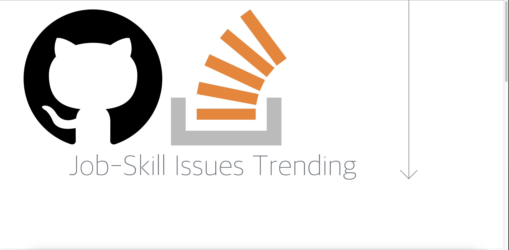

# StackHub

## 목차
- [프로젝트 주제](#프로젝트-주제)
- [프로젝트 소개](#프로젝트-소개)
- [기술 스택](#기술-스택)
- [협엽 명세](#협업-명세)
- [개발 인원](#개발-인원)

## 프로젝트 주제

프로그래머스 채용 공고 크롤링을 통한 기술스택과 기술스택의 레포지토리,질문 시각화

## 프로젝트 소개

기업에서 직무에 따라 원하는 기술스택이 다른데 우리가 하고자하는 직무의 기술스택이 어떤것이 있는지 알아보고 트렌드가 어떤지 확인하고 그 기술스택들이 github와 stackoverflow와 같은 개발자 커뮤니티에서는 우리와 같은 관심사를 가진 개발자들이 어떤 주제를 다루고 있고 또 어떤 문제들이 있는지 확인하며 한눈에 보기쉽게 그리고 이용하기 쉽게 하기 위해 선정하게 되었습니다.

 
1. **표지**
    
 

2. **시각화 페이지 직무별 스킬 인기도**
    
 

3. **시각화 페이지 스킬별 github repositroy**

 

4. **시각화 페이지 스킬별 stackoverflow question**

 

 

## 기술 스택

### 1. BackEnd
  
### 2. FrontEnd
  
### 3. Crawling
   
  

 

### 협업 명세

- 대시보드 디자인
    
    
- ERD
    
    
- API
    
## 개발 인원

| FrontEnd | BackEnd |  BackEnd   |  Crawling   |  Crawling   | 
| :--------: | :--------: | :------: | :-----: |  :-----: |
|   정승현   |   이승준   |   신용승   |   정기홍   |   이소윤   | 

 

